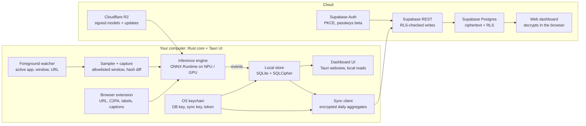
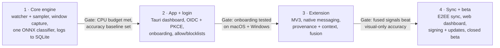

# AI Exposure Desktop App — Technical Spec

Exported Sep 28, 2026 · Mahmoud

## Overview

The desktop app measures how much of a user's viewing time is AI-generated content, analyzing everything on-device and syncing only aggregate statistics. Desktop is the first platform because macOS, Windows and Linux all allow permissioned window capture, which iOS does not.

**MVP scope**

- macOS 14+ and Windows 11; Linux as best-effort after beta.
- Tracked surfaces: browsers (Chrome, Edge, Safari, Firefox, Arc) and desktop apps on a user-editable allowlist.
- One visual AI-content classifier, plus provenance and context signals from a companion browser extension.
- Local dashboard, account login, optional aggregate sync and a web dashboard.

**Privacy principles (non-negotiable)**

1. Frames never touch disk and never leave the device.
2. Only allowlisted windows are captured; sensitive apps and private windows are never looked at.
3. The server receives end-to-end encrypted daily aggregates only, which it cannot read: no URLs, titles, captions or images.
4. The user can pause, inspect, export and delete everything, at any time.

## Architecture and stack

A Rust core does all capture, inference and storage; the Tauri web UI only reads results through a narrow command allowlist.



Frames move from the sampler to the inference engine in RAM only. The local store holds per-item events, and the sync client sends end-to-end encrypted daily aggregates. Login runs in the system browser against the auth provider; tokens land in the OS keychain.

| Layer | Choice | Why |
| --- | --- | --- |
| App shell | Tauri 2 (Rust core, web UI) | Small binary, low RAM, capability-scoped IPC; smaller attack surface than Electron |
| macOS capture | ScreenCaptureKit, single-window filter | Supported, permissioned, GPU-backed |
| Windows capture | Windows.Graphics.Capture | Per-window capture, works with DirectX surfaces |
| Linux capture | PipeWire via xdg-desktop-portal | Only supported path on Wayland |
| Foreground tracking | NSWorkspace + AX API (macOS); GetForegroundWindow + UI Automation (Windows) | App, window title, browser URL |
| Inference | ONNX Runtime: CoreML on macOS; Windows ML on Windows 11 24H2+, DirectML fallback on older builds | One model format; NPU/GPU acceleration chosen per device |
| Local store | SQLite + SQLCipher (WAL mode); key via the `keyring` crate | Encrypted at rest, key never on disk |
| Browser companion | MV3 extension + native messaging | DOM, captions, C2PA, platform AI labels |
| Auth | Supabase Auth (PKCE flow; passkeys in beta) | Passkeys and social login without custom auth code; same project as the database |
| Backend | Supabase Postgres with row-level security, constraints and triggers; one Edge Function (delete-account) | Stores encrypted aggregates only; per-user isolation enforced in the database |
| Models | One shared image encoder + AI-detection head + zero-shot category head | One forward pass per crop; small monthly head updates |
| Model + app updates | Cloudflare R2, signed files | No egress charges for the largest bandwidth line |
| Web dashboard | Static site on a separate origin | Decrypts in the browser; no server logic |

## Capture and inference pipeline

The model runs only when the visible content changes, which keeps steady-state cost to a few inferences per minute of scrolling.

1. **Gate.** The foreground watcher checks the active app or domain against the allowlist and blocklist. Not tracked → log time only, capture nothing.
2. **Probe (1 Hz).** Capture a 64×64 grayscale thumbnail of the target window and compute a perceptual hash (dHash).
3. **Change check.** Hamming distance above threshold, or 5 s since the last analysis while video plays → proceed; otherwise extend the current item's dwell time.
4. **Capture.** Grab the window at native resolution, crop to the content region (largest changing rectangle, or the region the extension reports), resize to the model input (224–384 px).
5. **Classify.** Run the ensemble:
   - Provenance: C2PA manifest, platform AI label or generator metadata from the extension. A hit is decisive.
   - Visual: open-source AI-image detector, fine-tuned on our labeled feed crops and INT8 quantized, run on the crop; for video, 2–3 frames over the dwell window.
   - Context: caption and hashtag text from the extension (browser) or on-device OCR (native apps, optional).
6. **Fuse.** Weighted logistic combination into `p_ai` plus a confidence band (high / medium / low).
7. **Discard.** Zeroize the frame buffers; write one event row. Nothing visual persists.

**Detection model.** Start from an open-source image encoder and AI-image detector, and fine-tune on our own labeled dataset of feed crops (compressed, cropped, overlaid with UI and captions, as users actually see them). The model is one shared encoder with light heads on top: the encoder gets a full fine-tune quarterly, the detection head monthly as the dataset grows. Each release ships as signed `model_version` files. Training data comes from our team's labeled collection and public datasets; user content never enters training unless a user explicitly donates a flagged item.

**Category.** A separate zero-shot head assigns `category`: the crop's encoder embedding is scored against pre-computed text embeddings of the category labels, which ship as a small file. It reuses the detection pass's embedding, runs only on items with `p_ai ≥ 0.5`, and new categories need a new label file, not retraining.

**Frames returning black** (DRM video, protected apps) are recorded as `unanalyzable`, never as human.

**Performance budget** (targets to validate in milestone 1):

| Metric | Target |
| --- | --- |
| Average CPU while tracking | ≤ 3% on a 2023+ laptop |
| Probe cost | ≤ 2 ms per tick |
| Visual inference latency | ≤ 40 ms per crop on NPU/GPU, ≤ 150 ms CPU fallback |
| Resident memory | ≤ 250 MB including model |
| Model size on disk | ≤ 100 MB (INT8 quantized) |
| Battery impact | ≤ 5% extra drain per hour of tracked use |

## Event format and local schema

Each analyzed content item becomes one event row; the dashboard reads events locally and sync sends only the daily rollup.

**Event (in-process, Rust struct serialized as JSON for the UI)**

```json
{
  "id": "01J9Z3K7Q8…",
  "started_at": "2026-09-27T19:01:05Z",
  "dwell_ms": 12400,
  "surface": "browser",
  "app": "com.google.Chrome",
  "domain": "instagram.com",
  "media": "video",
  "p_ai": 0.91,
  "confidence": "high",
  "signals": { "provenance": null, "visual": 0.88, "context": 0.90 },
  "category": "fitness",
  "model_version": "vis-0.3.1"
}
```

`ai_exposure_ms = dwell_ms × p_ai`, computed at query time.

**Local database (SQLCipher)**

```sql
CREATE TABLE events (
  id            TEXT PRIMARY KEY,          -- ULID
  started_at    INTEGER NOT NULL,          -- unix ms
  dwell_ms      INTEGER NOT NULL,
  surface       TEXT NOT NULL,             -- browser | app
  app           TEXT NOT NULL,
  domain        TEXT,                      -- NULL for native apps
  media         TEXT NOT NULL,             -- image | video | text | mixed
  p_ai          REAL,                      -- NULL when unanalyzable
  confidence    TEXT,                      -- high | medium | low
  category      TEXT,
  model_version TEXT NOT NULL
);
CREATE INDEX events_day ON events(started_at);

CREATE TABLE daily_rollup (
  day            TEXT NOT NULL,            -- local date YYYY-MM-DD
  platform       TEXT NOT NULL,            -- domain or app
  category       TEXT NOT NULL,
  total_ms       INTEGER NOT NULL,
  ai_ms          INTEGER NOT NULL,
  items          INTEGER NOT NULL,
  ai_items       INTEGER NOT NULL,         -- p_ai >= 0.7
  unanalyzable_ms INTEGER NOT NULL,
  synced_at      INTEGER,
  PRIMARY KEY (day, platform, category)
);

CREATE TABLE settings (
  key   TEXT PRIMARY KEY,
  value TEXT NOT NULL                      -- allowlist, blocklist, retention, sync opt-in
);
```

Retention: `events` are kept 90 days by default (user-adjustable, including 0 = rollups only); `daily_rollup` is kept until the user deletes it.

## Auth and sync

Login uses OAuth 2.0 authorization code + PKCE in the system browser (RFC 8252); the app never renders a login form or an embedded webview.

**Login flow**

1. User clicks Sign in. The core generates `code_verifier`, `code_challenge` (S256) and `state`, and starts a one-shot loopback listener on `127.0.0.1:<random port>`.
2. The core opens the system browser at the provider's `/authorize` with `redirect_uri=http://127.0.0.1:<port>/callback`.
3. User signs in (passkey, Google, Apple or email magic link).
4. The browser redirects to the loopback; the core checks `state`, closes the listener, and exchanges the code + verifier at `/token`.
5. The access token (JWT, 15 min) is held in memory only. The refresh token (rotating, 30-day absolute lifetime) goes to the OS keychain.
6. Fallback when loopback is blocked: a custom URL scheme (`aiexposure://callback`) registered at install.

**On Supabase:** the core uses Supabase Auth with the PKCE flow. The page opened in step 2 is a small sign-in page on our own domain (the passkey relying party), which runs Supabase's passkey or social sign-in and redirects back with the code. Add the loopback address to Supabase's redirect-URL allowlist; if a random loopback port is not accepted there, use the custom URL scheme from step 6 as the primary redirect. Passkey ceremonies never run inside the Tauri webview.

**Sync (opt-in, off until the user enables it)**

- Syncs when a day's rollup changed, at most every 6 hours, plus on quit and after local midnight, with a random per-device offset. Uploads one encrypted blob per device per day.
- Writes are direct upserts into `rollup_blobs` through the Supabase client. Row-level security, a size-bucket CHECK constraint and a version trigger enforce the rules in the database, so no Edge Function sits on the write path. The server never parses the ciphertext.
- Reads go straight to `rollup_blobs`; row-level security limits every read to the signed-in user.
- Each device writes only its own blobs; any client merges all devices' blobs for a day after decrypting, so there are no server-side merge conflicts.
- After 90 days the client compacts a month of daily blobs into one monthly blob per device (`period = 'month'`, `day` = first of the month) and deletes the dailies.
- Failed syncs retry with exponential backoff and jitter; the app is local-first, so an outage only delays sync.
- Delete account: Edge Function `delete-account` deletes the user from `auth.users` with the service role; every table cascades within the same transaction. The app also offers "wipe local data".

**End-to-end encryption (MVP)**

The server stores only ciphertext and wrapped keys; reading a user's data requires a key that exists only on their devices or in their passkey.

1. **Data key.** On first sync enable, the device generates a random 256-bit data key (DK). Each blob is encrypted with XChaCha20-Poly1305 under DK, with a fresh random nonce and `(user_id, device_id, day, version)` as associated data, so blobs cannot be swapped or replayed.
2. **Wrapping.** DK is stored on the server only in wrapped form, under two independent keys:
   - a passkey-derived key via the WebAuthn PRF extension, so the web dashboard can unlock with the same passkey used to sign in;
   - a recovery key (24 words) shown once at setup, for new devices and lost passkeys.
3. **Fallback.** Where the platform's passkey lacks PRF support, wrap DK with a key derived from a user passphrase via Argon2id instead.
4. **New device.** Sign in, fetch the wrapped DK, unwrap with passkey or recovery key, store DK in the OS keychain.
5. **Rotation.** `key_version` on every blob; rotating DK re-encrypts blobs client-side in the background.
6. **Loss.** If the user loses both passkey and recovery key, synced data is unrecoverable by design; local data on existing devices is unaffected. Onboarding must say this plainly.

**Metadata the server still sees:** account ID, device IDs, which days have activity, blob sizes and timestamps. Blobs are padded to fixed size buckets so size does not reveal how much was watched.

**Web dashboard caveat:** browser-based decryption trusts the JavaScript we serve. Mitigate with a strict CSP, Subresource Integrity, a separate static origin for the dashboard, and published build hashes; state the limitation in the security page.

**Server schema (Postgres)**

```sql
-- auth.users is managed by Supabase Auth; our tables reference it.

CREATE TABLE public.profiles (
  id          UUID PRIMARY KEY REFERENCES auth.users(id) ON DELETE CASCADE,
  created_at  TIMESTAMPTZ NOT NULL DEFAULT now()
);

CREATE TABLE public.wrapped_keys (
  user_id     UUID NOT NULL REFERENCES auth.users(id) ON DELETE CASCADE,
  method      TEXT NOT NULL,              -- passkey_prf | recovery | passphrase
  credential_id TEXT NOT NULL DEFAULT '', -- passkey credential for passkey_prf
  key_version INT NOT NULL,
  wrapped_dk  BYTEA NOT NULL,
  kdf_params  JSONB,                      -- salt, Argon2id params where used
  PRIMARY KEY (user_id, method, key_version, credential_id)
);

CREATE TABLE public.devices (
  id          UUID PRIMARY KEY,
  user_id     UUID NOT NULL REFERENCES auth.users(id) ON DELETE CASCADE,
  created_at  TIMESTAMPTZ NOT NULL DEFAULT now(),
  revoked_at  TIMESTAMPTZ,
  UNIQUE (id, user_id)
);

CREATE TABLE public.rollup_blobs (
  user_id     UUID NOT NULL REFERENCES auth.users(id) ON DELETE CASCADE,
  device_id   UUID NOT NULL,
  period      TEXT NOT NULL DEFAULT 'day' CHECK (period IN ('day', 'month')),
  day         DATE NOT NULL,              -- first of month when period = 'month'
  key_version INT NOT NULL,
  nonce       BYTEA NOT NULL CHECK (octet_length(nonce) = 24),
  ciphertext  BYTEA NOT NULL CHECK (octet_length(ciphertext) IN (4096, 16384, 65536)),
  version     INT NOT NULL,
  updated_at  TIMESTAMPTZ NOT NULL DEFAULT now(),
  PRIMARY KEY (user_id, device_id, period, day),
  FOREIGN KEY (device_id, user_id) REFERENCES public.devices(id, user_id) ON DELETE CASCADE
);

-- Reject stale or replayed writes.
CREATE FUNCTION public.check_blob_version() RETURNS trigger LANGUAGE plpgsql AS $$
BEGIN
  IF NEW.version <= OLD.version THEN
    RAISE EXCEPTION 'stale version';
  END IF;
  NEW.updated_at := now();
  RETURN NEW;
END $$;
CREATE TRIGGER blob_version BEFORE UPDATE ON public.rollup_blobs
  FOR EACH ROW EXECUTE FUNCTION public.check_blob_version();

-- Cap active devices per user.
CREATE FUNCTION public.check_device_cap() RETURNS trigger LANGUAGE plpgsql AS $$
BEGIN
  IF (SELECT count(*) FROM public.devices
      WHERE user_id = NEW.user_id AND revoked_at IS NULL) >= 10 THEN
    RAISE EXCEPTION 'device limit reached';
  END IF;
  RETURN NEW;
END $$;
CREATE TRIGGER device_cap BEFORE INSERT ON public.devices
  FOR EACH ROW EXECUTE FUNCTION public.check_device_cap();

ALTER TABLE public.profiles     ENABLE ROW LEVEL SECURITY;
ALTER TABLE public.wrapped_keys ENABLE ROW LEVEL SECURITY;
ALTER TABLE public.devices      ENABLE ROW LEVEL SECURITY;
ALTER TABLE public.rollup_blobs ENABLE ROW LEVEL SECURITY;

CREATE POLICY own_profile ON public.profiles     FOR SELECT USING (id = auth.uid());
CREATE POLICY own_keys    ON public.wrapped_keys FOR ALL    USING (user_id = auth.uid()) WITH CHECK (user_id = auth.uid());
CREATE POLICY own_devices ON public.devices      FOR ALL    USING (user_id = auth.uid()) WITH CHECK (user_id = auth.uid());
CREATE POLICY own_blobs   ON public.rollup_blobs FOR ALL    USING (user_id = auth.uid())
  WITH CHECK (user_id = auth.uid() AND EXISTS (
    SELECT 1 FROM public.devices d
    WHERE d.id = device_id AND d.user_id = auth.uid() AND d.revoked_at IS NULL));
```

Policies read `auth.uid()` from the verified Supabase JWT, so a bug in a client query cannot read another user's rows. The service-role key lives only in Edge Functions, never in the desktop app or the web dashboard.

**Data residency:** a Supabase project runs in one region, so EU and US users get separate projects; the sign-in page routes each user to one at signup and the desktop app stores which project it belongs to.

## Dashboard

The desktop dashboard reads the local database directly and works fully offline; the web dashboard shows the same metrics from synced rollups only.

| Metric | Definition | Shown as |
| --- | --- | --- |
| AI Exposure | Σ `dwell_ms × p_ai` for the period | Headline time, e.g. 1h 14m |
| AI Exposure % | AI Exposure ÷ total analyzed time | Percentage with day-over-day change |
| AI Content Encountered | Count of items with `p_ai ≥ 0.7` | Count |
| Confidence mix | Share of AI Exposure from high / medium / low confidence items | Stacked bar |
| Top AI categories | AI Exposure grouped by `category` | Ranked list |
| Top platforms | AI Exposure grouped by `platform` | Ranked list |
| Coverage | Analyzed time ÷ tracked time (unanalyzable excluded) | Small caption, so users know what the number covers |

**Views**

- **Today:** headline, % vs yesterday, top categories and platforms.
- **Trends:** 7 / 30 / 90-day line of AI Exposure and AI Exposure %.
- **Activity (desktop only):** recent items with platform, time, `p_ai` and signals, so users can check what was counted and flag mistakes. No thumbnails are stored.
- **Privacy:** allowlist and blocklist editor, pause, retention, sync toggle, export (JSON/CSV), wipe.

Misclassification flags stay local unless the user opts into sending the flag plus model signals (never the content) for model improvement.

## Permission onboarding by OS

Every OS makes screen access an explicit user grant, so onboarding explains the privacy model before each system prompt appears and handles a revoked permission as a normal state.

**Shared first screens (all OSes)**

1. Welcome: what the app measures, and the four privacy principles in plain words.
2. Choose what to track: pre-filled allowlist (major browsers, social apps) and blocklist (banking, password managers, health portals, private windows). Editable later.
3. Sign in (optional; the app works fully without an account).

**macOS**

1. Screen Recording: explain, then trigger the ScreenCaptureKit prompt; deep-link to System Settings → Privacy & Security → Screen & System Audio Recording if denied.
2. Accessibility (optional): needed for window titles and browser URLs outside the extension. Explain; deep-link.
3. Relaunch if macOS requires it after granting Screen Recording.
4. Recent macOS versions periodically ask users to re-confirm screen-recording access. Detect the lost grant, pause tracking, and show a one-click "Re-enable" banner.
5. Distribute outside the Mac App Store (Developer ID + notarization); the App Store sandbox conflicts with capture and Accessibility.

**Windows**

1. No system prompt for Graphics Capture from a desktop app; show our own consent screen and require an explicit "Start tracking" click.
2. Request a borderless capture where the OS allows it; otherwise explain the yellow border in onboarding.
3. SmartScreen: ship Authenticode-signed binaries from day one to avoid the unrecognized-app warning.

**Linux (post-beta)**

1. Wayland: the xdg-desktop-portal picker appears per session; store the portal restore token where supported so users don't re-pick every login.
2. X11: works without a portal; show the same consent screen.

**Browser extension (all OSes)**

1. The desktop app links to the store listing and detects the native-messaging handshake when installed.
2. Host permissions are requested per site from the allowlist, not `<all_urls>`.

## Security and privacy controls

These ship before the public beta; each is a release gate, not a follow-up.

**Distribution and supply chain**

- [ ] macOS: Developer ID signing, hardened runtime, notarization; entitlements limited to what capture needs.
- [ ] Windows: Authenticode signing (Azure Artifact Signing or an EV certificate).
- [ ] Signed auto-updates via the Tauri updater; update public key pinned in the binary.
- [ ] Model files signed and SHA-256 checked before load; downloads only from our CDN.
- [ ] Dependency audit in CI (`cargo audit`, `npm audit`), lockfiles committed, reproducible release builds.

**App hardening**

- [ ] Tauri capability allowlist: the UI can call read-only query commands and settings commands, never capture APIs.
- [ ] Strict CSP; no remote scripts or remote content in the webview.
- [ ] Native-messaging host accepts only our extension IDs; messages schema-validated.
- [ ] Frame buffers zeroized after inference; never written to swap-backed temp files.
- [ ] Crash reporting strips heap and frame data; opt-in only.

**Data protection**

- [ ] SQLCipher database, 256-bit key generated on first run and stored in the OS keychain.
- [ ] Access token in memory only; refresh token in the keychain; rotation with reuse detection.
- [ ] TLS 1.3 to the API; certificate pinning considered for the ingest host.
- [ ] Server: row-level security, encrypted backups, one Supabase project per region (EU, US), service-role key only in Edge Functions.

**User control**

- [ ] Default blocklist: banking, password managers, health portals, private/incognito windows.
- [ ] Tray indicator whenever tracking is active; one-click pause; global pause hotkey.
- [ ] Export all local data (JSON/CSV) and wipe local data from settings.
- [ ] Account deletion removes server data within 24 h.
- [ ] Privacy policy and in-app disclosure match exactly what the code collects; reviewed before each release.

**End-to-end encrypted sync** is in the MVP; its design and checks are in Auth and sync. Add to the release gate: an external review of the key-wrapping and blob format before the closed beta.

## Scalability and cost review

Every layer holds to 100,000 sync users for an estimated $80–120 a month, because detection runs on users' own machines and the server stores only a few KB per user per day. The changes below are already applied in the sections above.

| Layer | Choice | How it scales | Verdict |
| --- | --- | --- | --- |
| App shell | Tauri 2 | Client-only; installers are a few MB, so update bandwidth stays small | Keep |
| Capture + tracking | OS-native APIs | Runs on user hardware; no server cost per user | Keep; add a fallback that captures the display and crops to the window when window capture fails |
| Inference runtime | ONNX Runtime | No server inference at any user count | Windows ML on Windows 11 24H2+, DirectML only as fallback ([DirectML is in maintenance mode](https://github.com/microsoft/DirectML); [Windows ML keeps the ONNX Runtime APIs and picks the best provider per device](https://learn.microsoft.com/windows/ai/directml)) |
| Models | Shared encoder + two heads | One forward pass per crop | Halves compute per crop; category stays zero-shot and separate from detection |
| Local store | SQLite + SQLCipher | Per device; 90 days of events is a small table | Keep; WAL mode, nightly compaction |
| Browser extension | MV3 + native messaging | Client-only | Keep |
| Auth | Supabase Auth | [Pro includes 100,000 MAU, then $0.00325 per MAU](https://supabase.com/pricing) | Keep; sign in and refresh tokens only when sync is on |
| Database | Supabase Postgres | [Pro is $25/month with Micro compute; 8 GB disk, then $0.125/GB; extra projects from $10/month](https://supabase.com/pricing) | Keep; checks in the database, compact old blobs |
| Write path | Direct upserts with RLS + constraints | No per-call cost ([Edge Functions: 2M included, then $2 per million](https://supabase.com/pricing)) | Replaces the earlier `put-blob` Edge Function |
| Model + app updates | Cloudflare R2 | [No egress charges](https://developers.cloudflare.com/r2/pricing/) vs [Supabase egress $0.09/GB, $0.03/GB cached](https://supabase.com/pricing) | Largest bandwidth line, now free |
| Web dashboard | Static site | Static files, reads encrypted blobs | Separate static origin (e.g. Cloudflare Pages) |
| Code signing | Apple Developer ID; Azure Artifact Signing | Flat fees | [Artifact Signing is $9.99/month for 5,000 signatures](https://azure.microsoft.com/en-us/products/artifact-signing), for verified businesses in the US, Canada, EU and UK. Apple's program is about $99/year |

**Model distribution**

- Ship the encoder (large, updated quarterly with a full fine-tune) and the heads plus category label embeddings (a few MB, updated monthly) as separate signed files.
- Resumable downloads, SHA-256 check before load, previous version kept for instant rollback, staged rollout (5% → 25% → 100%) gated on the internal benchmark.

**Cost estimate (monthly, sync-enabled users)**

| Users | Supabase (US + EU projects) | R2 | Signing | Total |
| --- | --- | --- | --- | --- |
| 1,000 | ~$35 | ~$0 | ~$18 | ~$55 |
| 10,000 | ~$35 | ~$0 | ~$18 | ~$55 |
| 100,000 | ~$60–100 (compute upgrade if needed, ~50 GB disk) | ~$0 | ~$18 | ~$80–120 |

Assumptions: one device per user, 4 KB blobs, 4–5 writes per day, about 35 MB per month of model and app downloads. At 100,000 users those downloads are roughly 3.5 TB a month: free on R2, versus about $100 (cached) to $300 a month on Supabase egress. Past 100,000 users, auth MAU is the first cost that grows linearly: about $2,900 a month at 1 million users.

**Quality trade-off:** monthly head-only updates, mitigated by the quarterly full fine-tune and the benchmark gate. Benchmark the shared encoder against a fully fine-tuned standalone detector in phase 1; if it loses clearly, keep two models and accept the larger downloads.

## Milestones, risks and decisions

The core engine comes first because classifier accuracy on real feed content is the riskiest unknown, and it needs no UI to measure.



**Risks**

| Risk | Impact | Mitigation |
| --- | --- | --- |
| Visual classifier is weak on compressed, cropped feed content | Headline metric is not credible | Build a labeled benchmark from real feeds in phase 1; lean on provenance and context signals; show confidence bands |
| E2EE sync plus two OSes is a large scope for 2 developers | Beta slips | Use audited libraries (libsodium / RustCrypto) rather than custom crypto; one developer owns core + crypto, one owns UI + extension + backend; cut Linux and the web dashboard before cutting E2EE |
| Supabase passkeys are in beta, and the passkey-derived encryption key (PRF) path is untested with it | Passkey unlock unavailable at launch | Prototype sign-in + PRF on macOS and Windows in phase 2; ship with recovery key and passphrase unlock regardless |
| Detectors lag new generators | Accuracy decays over months | Versioned models, signed OTA updates, per-version reporting in rollups |
| macOS permission re-prompts cause silent drop-off | Gaps in tracked data | Lost-grant detection, banner, coverage metric in the dashboard |
| DRM or protected apps return black frames | Undercounted exposure | Record as unanalyzable; extension covers most web video |
| Antivirus flags a screen-capturing app | Install failures, trust damage | Signing from day one, submit to AV vendors, clear disclosure |
| Battery or CPU complaints | Uninstalls | Hash-gated inference, NPU providers, auto-throttle on battery |

**Decisions**

| Decision | Choice |
| --- | --- |
| Detection model | Open-source detector, fine-tuned on our labeled feed crops; improves each release as the dataset grows |
| Content category | Separate zero-shot classifier, run only on likely-AI items to save cost |
| Team | 2 developers |
| End-to-end encrypted sync | In the MVP |
| Backend | Supabase (Auth + Postgres + Edge Functions), one project per region |

**Still open**

- [ ] Target launch markets, which set data residency and consent wording?
- [ ] Timeline for each phase with 2 developers.
- [ ] Which open-source detector to start from, and how many labeled feed crops the phase 1 benchmark needs.

## Build order

Build in five phases with two lanes: Dev A owns the Rust core, models and crypto; Dev B owns the app shell, backend, extension and distribution. Each phase ends at a roadmap gate, and "Needs" lists the only hand-offs between lanes. Effort figures are rough estimates for 2 full-time developers (about 16–18 weeks to closed beta); revise them after phase 1.

**Start on day one (long lead times):** Apple Developer Program and Azure Artifact Signing enrollment (business verification), and collecting the labeled feed-crop dataset.

### Phase 0: Foundations (~1 week)

| # | Step | Owner | Needs |
| --- | --- | --- | --- |
| 0.1 | Monorepo: Rust workspace (core crate + Tauri app), extension, SQL migrations; CI building on macOS and Windows runners | B | — |
| 0.2 | Enroll in Apple Developer Program and Azure Artifact Signing | A | — |
| 0.3 | Supabase dev and prod-US projects, R2 bucket, domain for the sign-in page; migrations applied from CI | B | 0.1 |
| 0.4 | Labeled feed-crop collection: capture script, labeling guide, benchmark size target | A | — |
| 0.5 | Shared event and rollup types, compiled into both the core and the UI | A + B | 0.1 |

### Phase 1: Core engine (~4–5 weeks)

| # | Step | Owner | Needs |
| --- | --- | --- | --- |
| 1.1 | Foreground watcher for macOS and Windows | A | 0.1 |
| 1.2 | Window capture, 1 Hz probe, hash-based change detection | A | 1.1 |
| 1.3 | Encrypted local store: SQLCipher, keychain key, events and rollup tables | A | 0.5 |
| 1.4 | Baseline model: open-source encoder + detection head, INT8 ONNX export, benchmark on labeled crops; compare against a standalone fine-tuned detector | A | 0.4 |
| 1.5 | Inference runtime: CoreML, Windows ML, DirectML and CPU fallbacks | A | 1.2, 1.4 |
| 1.6 | End-to-end loop: capture → classify → zeroize → event row, with a CLI that prints daily stats | A | 1.3, 1.5 |
| 1.7 | Performance harness: CPU, RAM, battery, latency against the budget | A | 1.6 |
| 1.8 | Tauri shell with capability allowlist and CSP; Today and Trends views on mock events | B | 0.5 |
| 1.9 | Allowlist/blocklist, settings, pause and tray indicator | B | 1.8 |

**Gate 1:** CPU budget met on both OSes; benchmark baseline recorded; shared-encoder decision made.

### Phase 2: App and login (~3 weeks)

| # | Step | Owner | Needs |
| --- | --- | --- | --- |
| 2.1 | Wire the UI to the real core through read-only Tauri commands | B | 1.6, 1.8 |
| 2.2 | Onboarding: macOS permissions and lost-grant banner, Windows consent screen | B | 2.1 |
| 2.3 | Supabase Auth: sign-in page on our domain, PKCE via loopback or custom scheme, refresh token in keychain | B | 0.3 |
| 2.4 | Passkey + PRF prototype in Safari, Chrome and Edge on macOS and Windows | A | 2.3 |
| 2.5 | Zero-shot category head and label-embeddings file | A | 1.4 |
| 2.6 | Activity view with misclassification flag | B | 2.1 |

**Gate 2:** onboarding passes on fresh macOS and Windows machines.

### Phase 3: Extension and signal fusion (~3 weeks)

| # | Step | Owner | Needs |
| --- | --- | --- | --- |
| 3.1 | MV3 extension: per-site host permissions; URL, caption and C2PA extraction | B | 1.9 |
| 3.2 | Native-messaging host: extension-ID allowlist, schema validation | A | 3.1 |
| 3.3 | Provenance signals: C2PA verification, platform AI labels | A | 3.2 |
| 3.4 | Signal fusion calibrated on the benchmark; confidence bands | A | 2.5, 3.3 |
| 3.5 | Coverage metric and unanalyzable handling in the dashboard | B | 2.1 |

**Gate 3:** fused signals beat visual-only accuracy on the benchmark.

### Phase 4: E2EE sync, distribution, closed beta (~5–6 weeks)

| # | Step | Owner | Needs |
| --- | --- | --- | --- |
| 4.1 | Crypto module: data key, XChaCha20-Poly1305 blobs, padding, associated data; published test vectors | A | 1.3 |
| 4.2 | Key wrapping: passkey PRF, recovery key, Argon2id passphrase fallback; new-device unlock | A | 2.4, 4.1 |
| 4.3 | Server schema, RLS, constraints and triggers; tests proving user A cannot read or write user B | B | 0.3 |
| 4.4 | Sync client: cadence, random offset, backoff, monthly compaction | B | 4.1, 4.3 |
| 4.5 | Web dashboard: static site, passkey unlock, in-browser decryption, CSP + SRI | B | 4.2, 4.3 |
| 4.6 | `delete-account` Edge Function, export and wipe | B | 4.3 |
| 4.7 | Signing, notarization, Tauri updater, model files on R2 with hash check and rollback | A | 0.2, 1.5 |
| 4.8 | External review of the crypto design and blob format; privacy policy matches collection | A + B | 4.2, 4.4 |
| 4.9 | Closed beta with 20–50 users; opt-in crash reporting | A + B | 4.7, 4.8 |

**Critical path:** labeled dataset (0.4) → baseline model (1.4) → end-to-end loop (1.6) → fusion (3.4); and passkey PRF prototype (2.4) → key wrapping (4.2) → external review (4.8) → beta. If anything slips, cut Linux and the web dashboard (4.5) before cutting E2EE.
